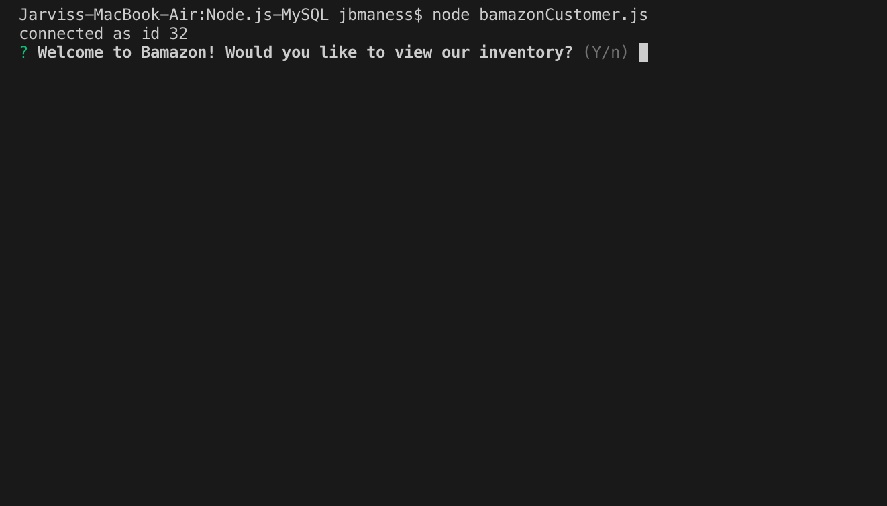
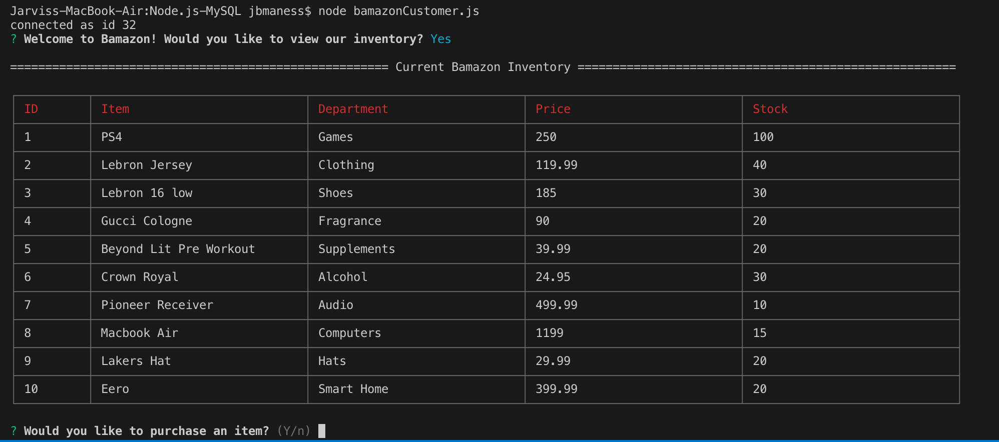
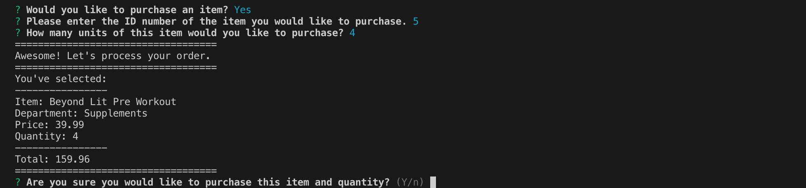

<h1 align="center">Welcome to Node.js-MySQL 👋</h1>
<p>
  
  <a href="https://github.com/jbjrock/Node.js-MySQL#readme">
    
  </a>
  <a href="https://github.com/jbjrock/Node.js-MySQL/graphs/commit-activity">
    
  </a>
</p>

> node.js-mysql

### 🏠 [Homepage](https://github.com/jbjrock/Node.js-MySQL#readme)

## Install

```sh
node bamazonCustomer.js
```
Bamazon Node App

## TECHNOLOGIES
JavaScript

mySql

Node.js

## CONCEPTS APPLIED
Modular Code

Inquirer for user interaction

Stored Procedures

## CUSTOMER








-From command line, in appropriate folder, type `node bamazonCustomer`

-Select product from the list and press enter.

-Enter the quantity to purchase and press enter.

-Confirm you would like to complete the sale y/n.

-View receipt, application will reset for next cust


## Requirements
## Node.js & MySQL
## Overview
In this activity, you'll be creating an Amazon-like storefront with the MySQL skills you learned this unit. The app will take in orders from customers and deplete stock from the store's inventory. As a bonus task, you can program your app to track product sales across your store's departments and then provide a summary of the highest-grossing departments in the store.

Make sure you save and require the MySQL and Inquirer npm packages in your homework files--your app will need them for data input and storage.

## Instructions
## Challenge #1: Customer View (Minimum Requirement)

Create a MySQL Database called bamazon.

Then create a Table inside of that database called products.

The products table should have each of the following columns:

item_id (unique id for each product)

product_name (Name of product)

department_name

price (cost to customer)

stock_quantity (how much of the product is available in stores)

Populate this database with around 10 different products. (i.e. Insert "mock" data rows into this database and table).

Then create a Node application called bamazonCustomer.js. Running this application will first display all of the items available for sale. Include the ids, names, and prices of products for sale.

The app should then prompt users with two messages.

The first should ask them the ID of the product they would like to buy.
The second message should ask how many units of the product they would like to buy.
Once the customer has placed the order, your application should check if your store has enough of the product to meet the customer's request.

If not, the app should log a phrase like Insufficient quantity!, and then prevent the order from going through.
However, if your store does have enough of the product, you should fulfill the customer's order.

This means updating the SQL database to reflect the remaining quantity.
Once the update goes through, show the customer the total cost of their purchase.
## Author

👤 **Jarvis Maness**

* Github: [@jbjrock](https://github.com/jbjrock)

## 🤝 Contributing

Contributions, issues and feature requests are welcome!<br />Feel free to check [issues page](https://github.com/jbjrock/Node.js-MySQL/issues).

## Show your support

Give a ⭐️ if this project helped you!

***
_This README was generated with ❤️ by [readme-md-generator](https://github.com/kefranabg/readme-md-generator)_